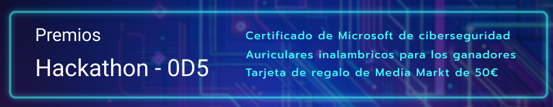

# Cómo entregar el proyecto del Hackathon ODS

¡Gracias por tu interés en contribuir al Hackathon ODS! 

Sigue estos pasos para hacer un fork y un pull request (PR) al repositorio.



## Pasos para Contribuir

### 1. Haz un Fork del Repositorio

1. Inicia sesión en tu cuenta de GitHub.
2. Navega al repositorio principal del Hackathon ODS.
3. Haz clic en el botón "Fork" en la esquina superior derecha de la página del repositorio.
4. Esto creará una copia del repositorio en tu cuenta de GitHub.
5. **Importante:** Sube tus cambios al fork en una rama que no sea `main`.

### 2. Clona tu Fork a tu Máquina Local

1. Abre una terminal o línea de comandos.
2. Clona tu fork a tu máquina local usando el siguiente comando, reemplazando `tu-usuario` con tu nombre de usuario de GitHub:

    ```bash
    git clone https://github.com/tu-usuario/nombre-del-repositorio.git
    ```

3. Navega al directorio del repositorio clonado:

    ```bash
    cd nombre-del-repositorio
    ```

### 3. Crea una Rama Nueva

1. Crea una rama nueva para tu equipo, nombrándola de la siguiente manera: `equipo-numero` (por ejemplo, `equipo-3`):

    ```bash
    git checkout -b equipo-<numero>
    ```

### 4. Realiza tus Cambios

1. Realiza los cambios necesarios en el código del repositorio.
2. Guarda tus cambios y verifica que todo funcione correctamente.

### 5. Confirma tus Cambios

1. Añade los archivos modificados al índice de Git:

    ```bash
    git add .
    ```

2. Realiza un commit con un mensaje descriptivo de los cambios realizados:

    ```bash
    git commit -m "Descripción de los cambios realizados por el equipo-<numero>"
    ```

### 6. Sube tus Cambios a GitHub

1. Sube tu rama al repositorio de GitHub en tu cuenta:

    ```bash
    git push origin equipo-<numero>
    ```

### 7. Crea un Pull Request (PR)

1. Navega a tu fork en GitHub.
2. Haz clic en el botón "Compare & pull request" junto a tu rama `equipo-<numero>`.
**Nota:** la rama hacia la que haces el PR debe llamarse igual para evitar confusiones.
3. Completa el formulario del PR proporcionando un título y una descripción detallada de los cambios realizados.
4. Asegúrate de que la base del PR sea la rama principal del repositorio original.
5. Haz clic en "Create pull request" para enviar tu PR para revisión.

## Revisiones y Feedback

- Un miembro del equipo de organización revisará tu pull request.
- Puede que recibas feedback o solicitudes de cambios. Responde a los comentarios y realiza los cambios necesarios.
- Una vez aprobado, tu PR será fusionado al repositorio principal.

**No dudes en preguntar a un mentor si tienes dudas sobre cualquiera de los pasos**


¡Gracias por contribuir y buena suerte en el Hackathon ODS! 🚀

---

**Organizado por**: Fundación Esplai, Aticco, ANUE, Data for Success, Microsoft
